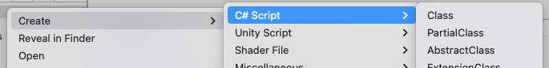

# TemplateUtil
Easily customizable Unity script templates\


**Recommended Installation** (Unity Package Manager)
- "Add package from git URL..."
- `https://github.com/ryanslikesocool/TemplateUtil.git`

**Alternate Installation** (Not recommended)
- Get the latest [release](https://github.com/ryanslikesocool/TemplateUtil/releases)
- Open with the desired Unity project
- Import into Plugins

## Usage
When in the Project view in Unity, right click into the `Create` menu.\
Select one of the script templates at the top of the list to create a new script from the desired template.

## About Templates
Templates are stored in `Assets/Plugins/TemplateUtil/Templates` as `.<type>.txt` files.\
`<type>` should be replaced with the desired result file extension.

## Modifying Templates
To modify a preinstalled template, modify the `.<type>.txt` file located in the template folder.  This should look about the same as a normal C# file.\
If TemplateUtil is installed via the Package Manager, duplicate the `.<type>.txt` file in the package cache and place it in `Assets/Plugins/TemplateUtil/Templates`.  The Package Manager verifies the integrity of packages every reload, so any changes will be overwritten if you edit the file in the package cache.  TemplateUtil will prioritize templates in the project's Plugins folder over ones from the package.

## Adding Templates
To add a template, create a new file with the extension `.<type>.txt` in the template folder.\
If TemplateUtil is installed via the Package Manager, create the file inside `Assets/Plugins/TemplateUtil/Templates`.\
Add the C# code you'd like for the template.  Refer to [Dynamic Text](#dynamic-text) for information on automatically filling certain text.\
In the package directory, locate the `Template Util Database` asset to add template files.
- Base Priority: The base menu priority of the list.  Items are kept in the order of the list below, but are offset within the larger Create menu by this amount.  -50 or lower will put the menu at the top of the Create menu.
- Folder: Groups to categorize templates.  Purely for organization in the editor
    - Menu Path: The path that the templates should be under in the `Create` menu
    - Preprocessor: Optional preprocessor to use for the templates (for example, `UNITY_URP` will only show the menu if the URP package is installed).  This string is inserted directly into the C# script, so using `&&` or `||` to combine preprocessors will work as expected.
    - Templates: All of the template files to include under the menu path.
- Generate: Generates the C# file to enable the menus.  This will overwrite the old file.

## Dynamic Text
- `#SCRIPTNAME#`: The name of the file when created
- `#ROOTNAMESPACEBEGIN#` and `#ROOTNAMESPACEEND#`: Wrap around an object to fill with the current assembly's namespace, if there is one.
- `#NOTRIM#`: Disables automatically trimming whitespace

## Preinstalled Templates
```
- C# Script/
    - Class
    - PartialClass
    - AbstractClass
    - ExtensionClass
    - PartialExtensionClass
    - SingletonClass
    - Struct
    - Interface
    - Enum
    - Attribute
- Unity Script/
    - MonoBehaviour
    - PartialMonoBehaviour
    - AbstractMonoBehaviour
    - MonoBehaviourSingleton
    - ScriptableObject
    - AbstractScriptableObject
    - Editor/
        - Editor
        - EditorWindow
        - AssetPostprocessor
        - PropertyDrawer
        - Build/
            - IPreprocessBuildWithReport
            - IPostprocessBuildWithReport
    - Jobs/
        - Job (IJob)
        - ForJob (IJobFor)
        - ParallelForJob (IJobParallelFor)
    - Universal Render Pipeline/
        - RenderFeatureSettings
        - ScriptableRenderFeature
        - ScriptableRenderPass
- DOTS Script/
    - AuthoringComponent (IConvertGameObjectToEntity)
    - Component/
        - Component (IComponentData)
        - BufferElementComponent (IBufferElementData)
        - MaterialPropertyOverride
    - System/
        - System (SystemBase)
        - SystemGroup (ComponentSystemGroup)
        - ConversionSystem (GameObjectConversionSystem)
- Shader File/
    - HLSLExtension (.hlsl)
    - Universal Render Pipeline/
        - URPUnlit (.shader)
- Miscellaneous/
    - PlainText (.txt)
    - JSON (.json)
    - Markdown (.md)
```
